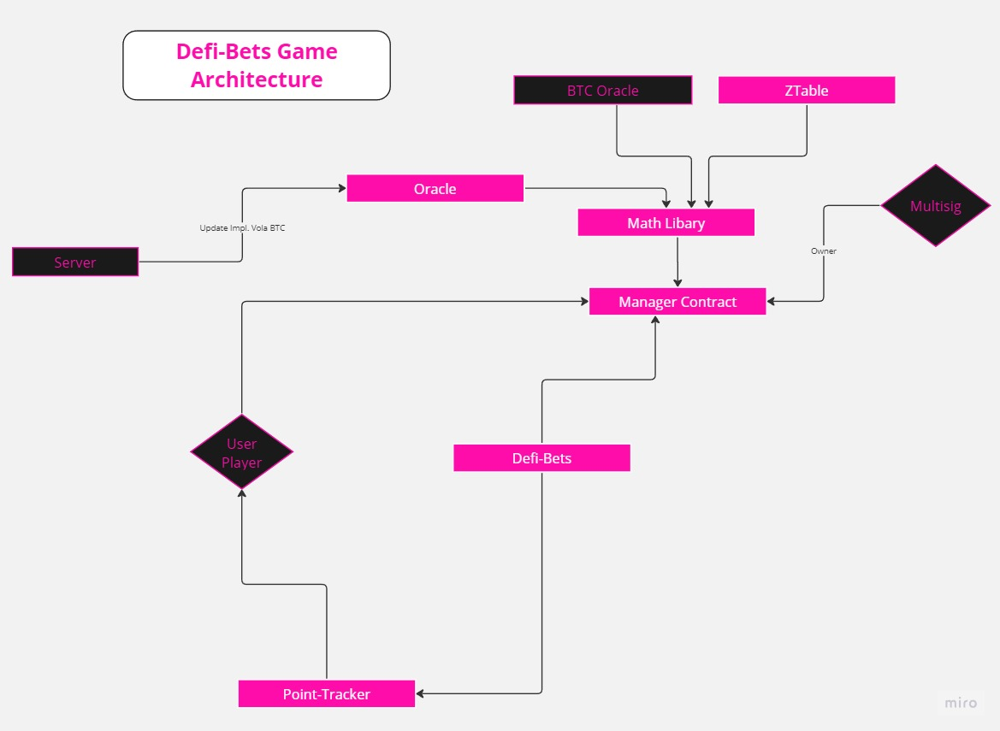

## 💸💸 Defi Bets Game

The DefiBets Game is an opportunity to bet on the prices of an underlying at a specific time.
The entire protocol consists of several smart contracts. The entry point is the DefiBetsManager contract. The following diagram roughly shows the process:



## Contents

- [Requirements](#requirements)
- [Quickstart](#quickstart)
- [Deploying your Smart Contracts to a Live Network](#deploying-your-smart-contracts-to-a-live-network)
- [Testing](#testing)

## Requirements

Before you begin, you need to install the following tools:

- [Node (v18 LTS)](https://nodejs.org/en/download/)
- Yarn ([v1](https://classic.yarnpkg.com/en/docs/install/) or [v2+](https://yarnpkg.com/getting-started/install))
- [Git](https://git-scm.com/downloads)
- [Foundry](https://book.getfoundry.sh/getting-started/installation)

## Quickstart

To get started with this Defi Bets Game repo, follow the steps below:

1. Clone this repo & install dependencies

```
git clone https://github.com/Defi-Bets/defi-bets-contracts.git
cd defi-bets-contracts
forge build
yarn install
```

## Deploying your Smart Contracts to a Live Network

Once you are ready to deploy your smart contracts, there are a few things you need to adjust.

1. Select the network

By default, `yarn deploy` will deploy the contract to the local network. You can change the defaultNetwork in `packages/hardhat/hardhat.config.ts.` You could also simply run `yarn deploy --network target_network` to deploy to another network.

Check the `hardhat.config.ts` for the networks that are pre-configured. You can also add other network settings to the `hardhat.config.ts file`. Here are the [Alchemy docs](https://docs.alchemy.com/docs/how-to-add-alchemy-rpc-endpoints-to-metamask) for information on specific networks.

Example: To deploy the contract to the Sepolia network, run the command below:

```
yarn deploy --network sepolia
```

2. Generate a new account or add one to deploy the contract(s) from. Additionally you will need to add your Alchemy API key. Rename `.env.example` to `.env` and fill the required keys.

```
DEPLOYER_PRIVATE_KEY=""
RPC_URL=""
ALCHEMY_API_KEY=""
POLYGON_SCAN_API_KEY=""
```

The deployer account is the account that will deploy your contracts. Additionally, the deployer account will be used to execute any function calls that are part of your deployment script.

You can generate a random account / private key with `yarn generate` or add the private key of your crypto wallet. `yarn generate` will create a random account and add the DEPLOYER_PRIVATE_KEY to the .env file. You can check the generated account with `yarn account`.

3. Deploy your smart contract(s)

Run the command below to deploy the smart contract to the target network. Make sure to have some funds in your deployer account to pay for the transaction.

```
yarn deploy --network network_name
```

4. Setup the Defi-Bets contracts

Run the command below for the initial setup of the smart contract to the target network.

```
yarn setup --network network_name
```

5. Initialise new Exp time and Start a new season

Before players can bet, the times and a new season must be activated.

```
yarn hardhat init-exp-times --network network_name
yarn hardhat start-season --days days_until_end_of_season --network network_name
```

In addition, there are a few other tasks that are available for interacting with the smart contracts.

## Testing

All testing is done using the Framework Foundry.

**Foundry is a blazing fast, portable and modular toolkit for Ethereum application development written in Rust.**

Foundry consists of:

- **Forge**: Ethereum testing framework (like Truffle, Hardhat and DappTools).
- **Cast**: Swiss army knife for interacting with EVM smart contracts, sending transactions and getting chain data.
- **Anvil**: Local Ethereum node, akin to Ganache, Hardhat Network.
- **Chisel**: Fast, utilitarian, and verbose solidity REPL.

## Documentation

https://book.getfoundry.sh/

## Usage

### Build

```shell
$ forge build
```

### Test

```shell
$ forge test
```

### Format

```shell
$ forge fmt
```

### Gas Snapshots

```shell
$ forge snapshot
```

### Anvil

```shell
$ anvil
```

### Cast

```shell
$ cast <subcommand>
```

### Help

```shell
$ forge --help
$ anvil --help
$ cast --help
```
